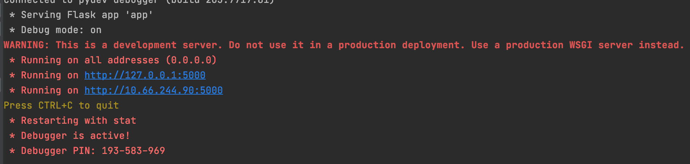
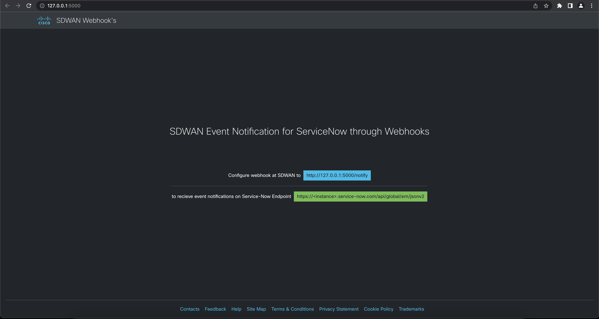
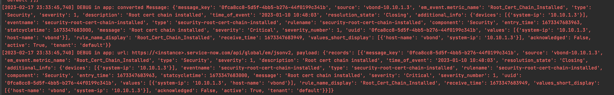

# gve_devnet_sdwan_servicenow_event_workflow
An intermediate web application which acts as an mapper and forwarder between SDWAN webhook notification and  the Service Now web event collection API.


## Contacts
* Raveesh Malyavantham V

## Solution Components
*  Python
*  Flask
*  ServiceNow API (Event Collection)

## Related Sandbox Environment


## Prerequisites
**SD-WAN Credentials**: vManage REST API access control is based on sessions. All users will be able to get a session after successfully logging in. In order to use the SD-WAN APIs, you need to make note of the vManage IP address, username, and password of your instance of SD-WAN. These credentials will be used to generate a session token and a CSRF prevention token if needed for POST operations. Note these values to add to the credentials file during the installation phase.

> For more information about SD-WAN API authentication, read the [documentation](https://developer.cisco.com/docs/sdwan/#!authentication/how-to-authenticate)

## Installation/Configuration
1. Clone this repository with `git clone [repository name]`
2. Update the service now host details in ```.env``` file.
```
SERVICE_NOW_HOST=<instance>.service-now.com

SERVICE_NOW_CLIENT_ID=<client-id>
SERVICE_NOW_CLIENT_SECRET=<client-secret>
SERVICE_NOW_USERNAME=<username>
SERVICE_NOW_PASSWORD=<password>

# optionally update other configuration based on requirement
```
3. Set up a Python virtual environment. Make sure Python 3 is installed in your environment, and if not, you may download Python [here](https://www.python.org/downloads/). Once Python 3 is installed in your environment, you can activate the virtual environment with the instructions found [here](https://docs.python.org/3/tutorial/venv.html).
4. Install the requirements with `pip3 install -r requirements.txt`

### Setting up webhooks at SDWAN
Steps for enabling Webhook in SDWAN (learning lab) at [here](https://developer.cisco.com/learning/labs/sd-wan-webhooks/getting-started-with-webhooks-on-cisco-sd-wan/)  
or  
Establishing SDWAN Alerts and notification at [here](https://www.cisco.com/c/en/us/td/docs/routers/sdwan/configuration/Monitor-And-Maintain/monitor-maintain-book/m-alarms-events-logs.html)

The following blocks in ```app.py``` defines the mapping options of the notification with service now event message format. **( * )** represents full / entire record
```python
    mapping_fields={
        "message_key" : "uuid",
        "source" : "values",
        "em_event.metric_name" : "rule_name_display",
        "type" : "component",
        "severity" : "severity_number",
        "description" : "message",
        "time_of_event" : "receive_time",
        "resolution_state" : "active",
        "additional_info" : "*"
    }
```
Instructions for Event Mapping on Service Now at [here]( https://docs.servicenow.com/en-US/bundle/tokyo-it-operations-management/page/product/event-management/task/send-events-via-web-service.html)

## Usage
To run the code, use the command:
```
$ python3 app.py
```
to run application in background, please follow steps [here](https://www.digitalocean.com/community/tutorials/nohup-command-in-linux)

# Screenshots

#### Running ```app.py```


#### Instructions or Landing page


#### Logging in file if FLASK_DEBUG is enabled during webhook processing


### LICENSE

Provided under Cisco Sample Code License, for details see [LICENSE](LICENSE.md)

### CODE_OF_CONDUCT

Our code of conduct is available [here](CODE_OF_CONDUCT.md)

### CONTRIBUTING

See our contributing guidelines [here](CONTRIBUTING.md)

#### DISCLAIMER:
<b>Please note:</b> This script is meant for demo purposes only. All tools/ scripts in this repo are released for use "AS IS" without any warranties of any kind, including, but not limited to their installation, use, or performance. Any use of these scripts and tools is at your own risk. There is no guarantee that they have been through thorough testing in a comparable environment and we are not responsible for any damage or data loss incurred with their use.
You are responsible for reviewing and testing any scripts you run thoroughly before use in any non-testing environment.